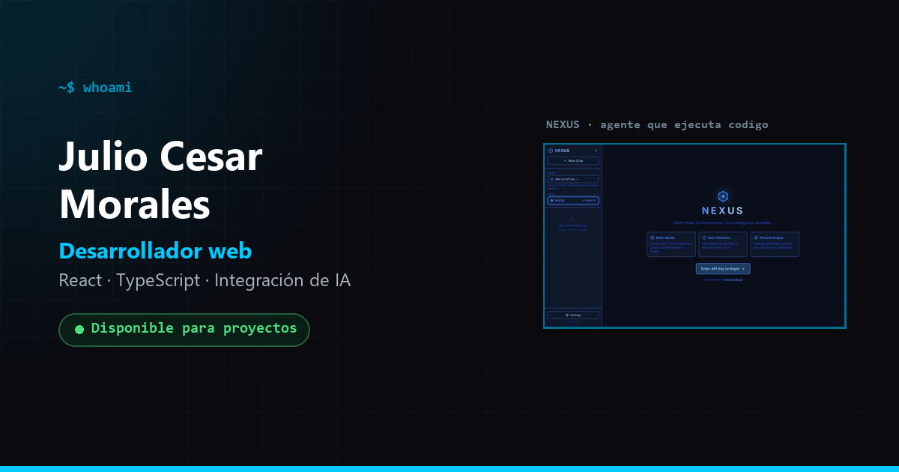

# Portfolio — Julio Cesar Morales

[](https://github.com/Victor00128/julio-cesar-portfolio/actions/workflows/ci.yml)
[](./LICENSE)

Personal portfolio built with **React 19 + TypeScript + Vite + Tailwind CSS v4**.

**Live:** [julio-cesar-morales.netlify.app](https://julio-cesar-morales.netlify.app)



## Features

- Responsive dark UI with reduced-motion support across CSS and Framer Motion
- WCAG AA colour contrast and visible keyboard focus
- Technical SEO: Open Graph, Twitter cards, JSON-LD, canonical
- GitHub stats resolved at deploy time — one static JSON, not 14 API calls per visitor
- Contact form via Formspree, with loading/success/error states
- CV generated from a script, so the PDF never drifts from the site

## Tech stack

| Category   | Technology     |
| ---------- | -------------- |
| Framework  | React 19       |
| Language   | TypeScript 5   |
| Build tool | Vite 7         |
| Styling    | Tailwind CSS 4 |
| Animations | Framer Motion  |
| Icons      | React Icons    |
| Deploy     | Netlify        |

## Getting started

```bash
git clone https://github.com/Victor00128/julio-cesar-portfolio.git
cd julio-cesar-portfolio
npm install
npm run dev
```

The dev server runs at `http://localhost:5173`.

## Commands

| Command             | What it does                                          |
| ------------------- | ----------------------------------------------------- |
| `npm run dev`       | Dev server with HMR                                   |
| `npm run build`     | Production build into `dist/`                         |
| `npm run preview`   | Serve the production build locally                    |
| `npm run typecheck` | `tsc --noEmit` — `vite build` does **not** check types |
| `npm run stats`     | Regenerate `public/github-stats.json`                 |
| `npm run cv`        | Regenerate `public/CV-Julio-Cesar.pdf`                |

## GitHub stats

The stats section reads `public/github-stats.json`, generated by
`scripts/fetch-github-stats.mjs`. It is committed to the repo and refreshed
weekly by `.github/workflows/stats.yml`.

Doing it in the browser meant 14 calls to the GitHub API per cold visitor.
Unauthenticated, that API allows 60 calls per hour per IP — so the fourth
visitor behind the same NAT hit the rate limit and the section broke.

To refresh it by hand:

```bash
npm run stats     # set GITHUB_TOKEN to raise the rate limit
```

## CV

`scripts/generate_cv.py` builds the PDF (two columns, sidebar, photo).
Requires Python with `reportlab`:

```bash
pip install reportlab
npm run cv
```

Drop a square portrait at `assets/foto.jpg` and the script picks it up
automatically. Without one it falls back to the initials.

## Environment variables

Copy `.env.example` to `.env`. Only `VITE_FORMSPREE_URL` is read by the app —
everything else (GitHub username, links, e-mail) lives in the source.

```bash
cp .env.example .env
```

## Deploy

**Netlify** — build command `npm run build`, publish directory `dist`.

**Vercel** — run `vercel` and follow the CLI.

## Project structure

```text
src/
├── components/       UI sections (Hero lives in App.tsx)
├── hooks/            useGitHubData
├── App.tsx
├── index.css         Tailwind theme + global styles
└── main.tsx
scripts/
├── fetch-github-stats.mjs
└── generate_cv.py
public/
├── CV-Julio-Cesar.pdf
├── github-stats.json
├── og-image.png
└── projects/         Screenshots (WebP)
```

## Notes

- Forking this? Change the contact details, the Formspree endpoint and the
  GitHub username in `scripts/fetch-github-stats.mjs`.
- CV preparation notes live in [`docs/CV-INSTRUCTIONS.md`](./docs/CV-INSTRUCTIONS.md).

## License

MIT. See [LICENSE](./LICENSE).
